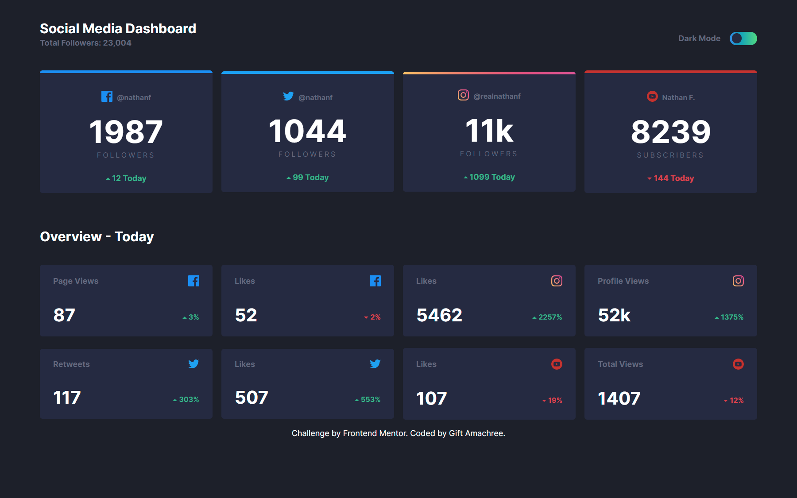

# Frontend Mentor - Social media dashboard with theme switcher solution

This is a solution to the [Social media dashboard with theme switcher challenge on Frontend Mentor](https://www.frontendmentor.io/challenges/social-media-dashboard-with-theme-switcher-6oY8ozp_H). Frontend Mentor challenges help you improve your coding skills by building realistic projects.

## Table of contents

- [Frontend Mentor - Social media dashboard with theme switcher solution](#frontend-mentor---social-media-dashboard-with-theme-switcher-solution)
  - [Table of contents](#table-of-contents)
  - [Overview](#overview)
    - [The challenge](#the-challenge)
    - [Screenshot](#screenshot)
    - [Links](#links)
  - [My process](#my-process)
    - [Built with](#built-with)
  - [Author](#author)

## Overview

### The challenge

Users should be able to:

- View the optimal layout for the site depending on their device's screen size
- See hover states for all interactive elements on the page
- Toggle color theme to their preference

### Screenshot

### Links

- Solution URL: [My solution Url](https://github.com/jen67/hosting/tree/main/social-Media-dark-and-light-theme)
- Live Site URL: [My live url](https://jen67.github.io/hosting\social-Media-dark-and-light-theme/index.html)

## My process

### Built with

- Semantic HTML5 markup
- CSS custom properties
- Flexbox
- Mobile-first workflow
- javaScript

## Author

- Frontend Mentor - [@jen67](https://www.frontendmentor.io/profile/jen67)
- Linkedin - [Gift Amachree](https://www.linkedin.com/in/gift-amachree-8a523623b/)
